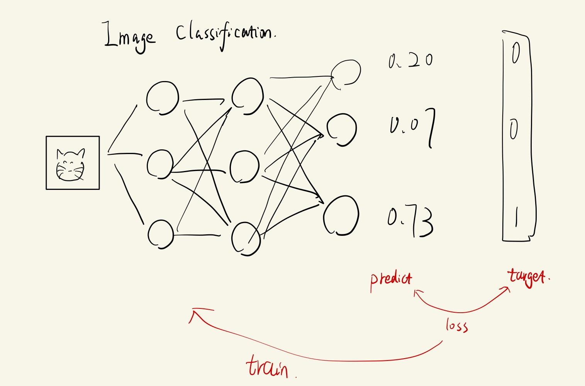
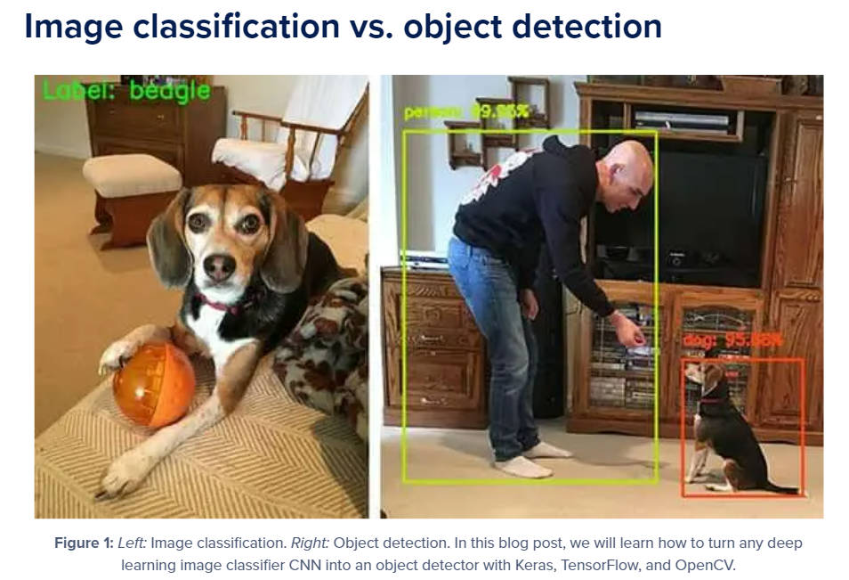
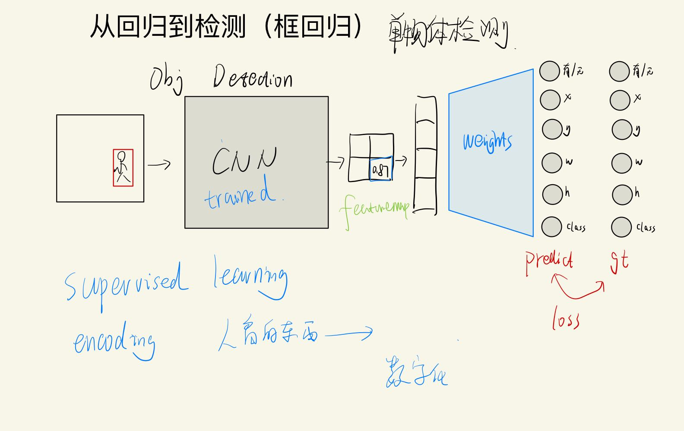
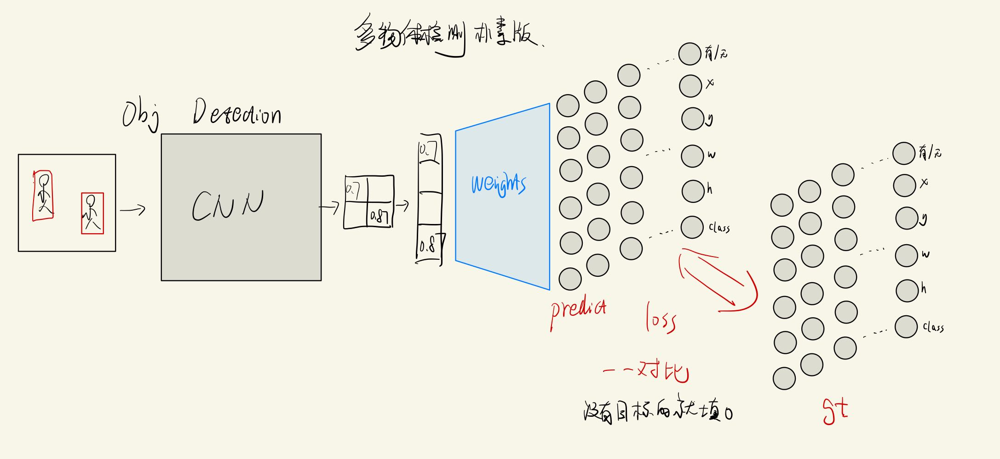
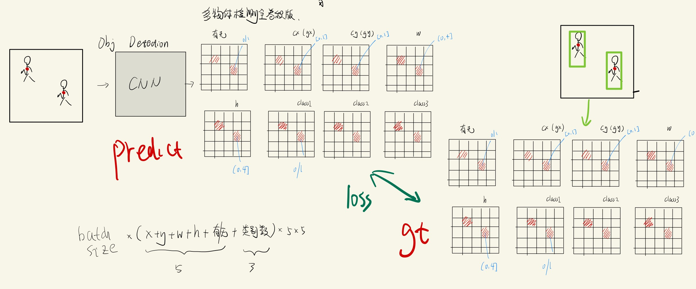
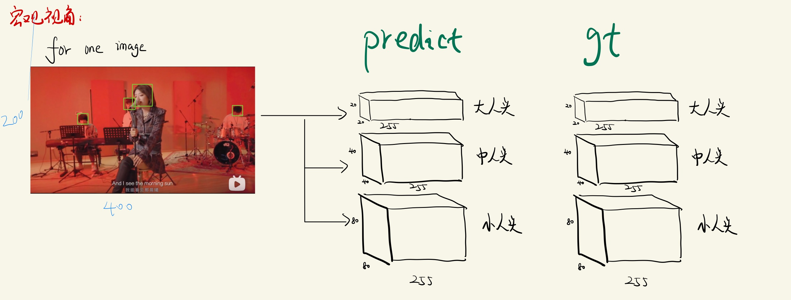

<!-- vscode-markdown-toc -->
* 1. [基础必学：](#)
* 2. [从分类到检测](#-1)
	* 2.1. [分类 --> 回归 --> 检测](#----)
		* 2.1.1. [1.0版本（单目标检测）](#-1)
		* 2.1.2. [2.0版本（多目标检测，简单升级版）](#-1)
		* 2.1.3. [3.0 版本（多目标检测，全卷积高级版本）](#-1)

<!-- vscode-markdown-toc-config
	numbering=true
	autoSave=true
	/vscode-markdown-toc-config -->
<!-- /vscode-markdown-toc -->

# A-series-of-CV
**温馨提示**
- ⚡强烈建议⚡下载下来阅读，可以看到颜色更丰富的字体
- 尽量以结构化思维来阅读，即尤其注意每一部分的开头和结尾小结，这将有助于你了解每一小段的主旨大意，使得你可以选择是否现在需要学习它以及要打算要学习到哪种程度。越缩进的越是细节,看不懂可暂时不看,更多用来作为补充
- 一般地，ref都是我看过的，良心推荐，所以如果需要额外补充和更加详细的讲解，可以阅读ref。如果想跟我们在 reference 阅读上进行更多互动，或者更快速地把握阅读重点，推荐使用Hypothesis Google插件并且通过以下链接进入便可以看到这篇文章内我阅读时认为的重点和有意思的批注。论文不一定完全看完，但是一些插图和对符号的描述很有助于理解
    - https://hypothes.is/groups/DymmQBML/shouxieai
    - 通过该插件看到的颜色，你应该可以更好更快地阅读和理解
 
 

##  1. 基础必学：
请右拐去学习以下内容
（代码+视频）https://github.com/shouxieai/A-series-of-NLP  
- ⚡注意⚡ CV 和 NLP的前置基础是几乎一样的
- dataset 和 dataloader
- 梯度下降
- 线性回归(低级版本)
- 线性回归(矩阵版本，高级版本)
- 逻辑回归
- 其它（正在更新）

⚡小结⚡：通过以上的学习，你应该至少已经了解了一个最基本的概念，如果简单地将神经网络理解成一个黑箱。那么给定一张图片，你可以通过不断告知它这是猫，那是狗，那是猪来训练出一个image classifier。如下图：

    
    <h4>图像分类</h4>

 

##  2. 从分类到检测
reference: 
- [1] 缓缓从分类过渡到检测 https://www.bilibili.com/video/BV12y4y1v7L6?share_source=copy_web
    - 观看建议：只需观看原理即可，代码可忽略
- [2] https://www.pyimagesearch.com/2020/06/22/turning-any-cnn-image-classifier-into-an-object-detector-with-keras-tensorflow-and-opencv/
    - 本篇文章的思想其实就是MTCNN的思想,对sliding window框到的图片，都拿去做图像分类任务
        - MTCNN implementation 仅推理 https://github.com/shouxieai/MTCNN
- [3] 手写yolov1https://www.bilibili.com/video/BV1xr4y1y7DD?share_source=copy_web
    - 了解最开始的yolo的思想和手写实现yolo
- [4] yolov1 paper https://arxiv.org/pdf/1506.02640.pdf

**以下是对上面 reference 的总结和延伸**

 

###  2.1. 分类 --> 回归 --> 检测
####  2.1.1. 1.0版本（单目标检测）
 

了解了classification.jpg的图后，我们必须搞清楚分类和检测的  **主要区别**  如图

    
    <h4>分类 和 检测的 标签区别 </h4>

 

    
    <h4>单目标检测.jpg</h4>

从这张图里，我们可以看出，原来我们的模型输出的是一个prediction，这个我们让这个prediction尽量地去逼近正确的onehot, 这里我们改变一下思路，我们不让输出值不断逼近正确的onehot了。我们让他逼近新的东西。

- 在这里我们引入一个新的概念，叫做 **编码encoding**。
- 我们可以简单地将encoding理解为将物理世界中真实的东西，变成计算机能够理解的东西。
    - 在分类中，我们将真值（gt或者target）编码成 onehot vector
    - 在检测中，我们将 gt 编码成 x,y,w,h,class,confidence
        - 如上图，人本身就在右下角区域，经过卷积后（卷积具有空间相对位置不变性）我们再flatten。我们赋予最后flatten后的vector 有/无xywh class 的含义，让这些值回归真实的值，经过一段时间的训练后，我们的神经网络便可以做 **单目标检测** 了

 

####  2.1.2. 2.0版本（多目标检测，简单升级版）

    
    <h4>多目标检测朴素版本.jpg</h4>

一张图里最多有多少个人，就搞多少列，我们发现这种方式过于臃肿，而且原始图片的信息也并没有保留。因此我们考虑用全卷积。

 

####  2.1.3. 3.0版本（多目标检测，全卷积高级版本）
- 现在我们用 **全卷积**来做这件事，扔掉flatten和全连接。
    - 全卷积的好处：可以保留空间相对位置

    
    <h4>多目标全卷积版本_拆开版</h4>

    
    <h4>多目标全卷积版本_合起来版 </h4>

上图中，假设我们只有3个类别（e.g. 人、猫、狗)。

**小结** ：到目前为止，我们应当确保自己至少对以下这句话是理解的：
目标检测其实就是一个回归问题，我们将predict输出的tensor上的值不断地去逼近gt上的真值。至于真值到底长什么样（即我们到底是如何具体地去 **编码** 目标(e.g.人头检测中的人头)的 ),我们稍后会谈到。

